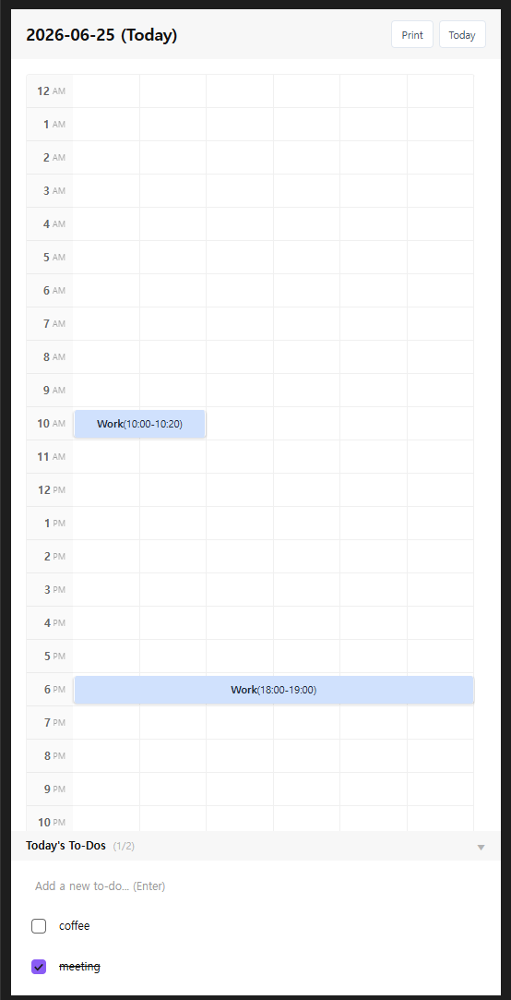

# DayTime Tracker (Obsidian Timeline Logging Plugin)

An Obsidian plugin that lets you intuitively log daily activities in a 10-minute grid timetable and stores them in your note.  

---

## ✨ Key Features

1. **10-Minute Timetable Grid**: Displays 24 hours of the day with 6 cells per hour (10 minutes per cell). You can easily record your activities by dragging and selecting a time range.
2. **Category-Based Grid & Visualization**: Each activity log is overlayed on the timeline with color chips based on the designated category. Hovering over a log shows a tooltip with details and the linked To-Do item.
3. **Collapsible To-Do List & Timeline Integration**:
   - A collapsible To-Do list is situated at the bottom of the timeline view.
   - When marking a To-Do as complete: A confirmation window asks, `"Would you like to record this To-Do on the timeline?"`. Clicking [Confirm] opens the activity log modal with the To-Do text pre-filled and the time set to the current hour.
   - When unchecking a To-Do: If a linked timeline log exists, a confirmation window pops up asking, `"Would you like to delete the linked timeline log too?"`, supporting one-touch synchronized deletion.
4. **Intuitive Form Layout**: The fields in the activity creation and edit modal are arranged cleanly in the order of: `Time settings -> Category chip selection -> Notes (detailed description) -> Linked To-Do`, facilitating quick entries.
5. **Personalization (Settings)**:
   - **General**: Configure the start and end hour range for the day, toggle whether to automatically hide the note's properties section (Frontmatter Metadata Container), select the UI language (Korean/English), and choose a background theme mode (Default / Paper White).
   - **Category Management**: Edit the names and customize the colors of the 5 default categories (Work, Study, Rest, Reading, Exercise). You can also add up to 10 custom categories, and easily delete custom ones by clicking the `X` button.
6. **Go to / Create Today's Daily Note**: Features a one-touch button to search for or create today's daily note (`YYYY-MM-DD.md`) and open it immediately.
7. **Print Timeline to PDF & Export HTML**:
   - Click the **[Print PDF]** button at the top-right header to export today's timeline grid and To-Do list into a print-optimized HTML file.
   - The exported file opens automatically in your system's default browser, providing a dedicated print button to save it as a clean PDF or print it without font or styling issues.

---

## 💡 Usage

1. **Open the Timeline View**:
   Click the **calendar-clock icon** in the ribbon menu or search for `Open DayTime Tracker View` in the command palette (`Ctrl + P` or `Cmd + P`) to open the timeline panel in the right sidebar.
2. **Open Daily Note**:
   If there is no active note, click the **[Create Today's Daily Note]** in the timeline view to immediately generate and start logging on today's note.
3. **Use To-Do List & Interactivity**:
   - Click the arrow button in the "Today's To-Dos" header to collapse or expand the section.
   - Add new tasks and check the checkbox when they are completed.
   - Follow the prompts in the confirmation modal to immediately map the completed To-Do to the timetable, or dynamically sync and delete the linked timeline log when unchecking a task.
4. **Drag to Record & Select To-Do**:
   - Drag and drop on the timetable to select a time range.
   - In the activity modal, you can click on any incomplete To-Do chips at the bottom to automatically pre-fill the activity details.
   - Once saved, a colored block will overlay the grid and the log entry will be saved in the note's Frontmatter.
5. **Print PDF / Export**:
   - Click the **[Print PDF]** button at the top-right header of the timeline.
   - Once exported, a notice will appear and a browser tab will automatically open with a print preview.
   - Click the **[Save as PDF / Print]** button at the top of the browser page to open the print dialog.

